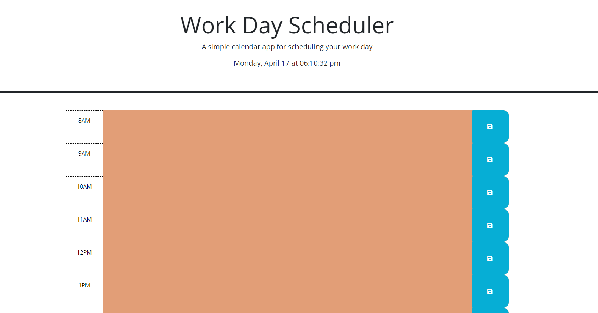
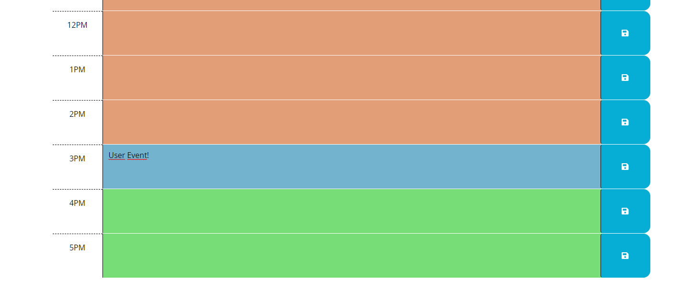

# 05-Scheduler-APIs
This repo is created for the 05 challenge of the EdX &amp; Tec de Monterrey bootcamp.

## Description

This web application is an Hourly Schedule site that presents the user time blocks for standard business hours, these change in color to match events in the past, present and future at the moment the application is being used. These time blocks can save different events in each hour and the app stores them in the local storage so they can be reviewed later.

## Mockup

The site should have the functionality described in the following image:

## Link

Follow this URL to access the website: https://alextrejo92.github.io/05-Scheduler-APIs/

## Installation

N/A

## Credits

The web page design was provided by EdX bootcamps & Tec de Monterrey. The functionality of the page was coded by me with assistance from an EdX Tutor.

## License

Standar MIT license.